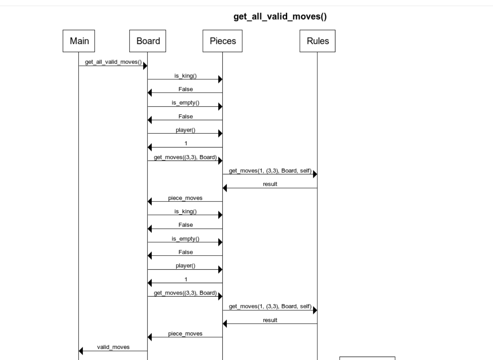

## Luokkakaavio
Sovellus ajetaan Main moduulin kautta, tämä tullaan rikkomaan myöhemmin pienemmiksi paloiksi.

Board edustaa pelilautaa ja samalla on pelimoottori. Tämäkin tullaan rikkomaan myöhemmin pienemmiksi

Setting on vastuussa pelin asetuksien säätämisestä. Tällä hetkellä Setting on hieman suuri, voisi rikkoa enemmän tulevaisuudessa

Piece edustaa yhtä nappulaa pelilaudalla, joka pystyy liikkumaan tietyllä tavalla, omistaa kuvan ja tietoa onko erikoisnappula kuten kuningas.

Rule on yksittäinen nappulan liikkumista koskeva sääntö.

Move on yksittäinen liike pelilaudalla jolla on jokin aloitusruutu, lopetusruutu ja pelinappula jolla on liikuttu

Luokilla Piece ja Rule on monta aliluokkaa, Knight, King, Queen, SingleSlide, CombinedSlide, mutta näin pieneksi rikkominen ei ole oleellista koko sovellusta kattavassa luokkakaaviossa

Aluksi sovelluksen pelatessa Mainissa halutaan tuottaa kaikki lailliset liikkeet.

Mainista kutsutaan Boardia tuottamaan nämä.

Board tarkistaa jokaisella nappulallaan että eihän tämä ole tyhjä, tai kuningas jos halutaan estää kuningas erikoistapauksissa jolla estetään linnoitusliikkeiden tarkistamisen mahdollistama ikuinen looppi.

Sitten Board pyyttää nappulalta sen liikkeet.

nappula vuorostaan pyytää sen sääntöjä muodostamaan niitä vastaavat mahdolliset liikkeet nykyisessä tilassa.

Säännöt palauttavat nämä liikeet nappulalle joka palauttee ne Boardille.

Nyt Board tarkistaa liikkeiden laillisuuden.

Tehdääksen tämän Board tarkistaa ettei liikeiden jälkeen kuningas ole shakissa.

Tämän tehdäkseen Board simuloi vastustajan mahdolliset liikkeet, joissa ei tarvitse tarkistaa ettei kuningas joudu shakkiin.

Menemme siis aikaisemman syklin uudestaan läpi.

Board näin poistaa laittomat liikeet ja voi vihdoin palauttaa Mainiin lailliset liikeet

