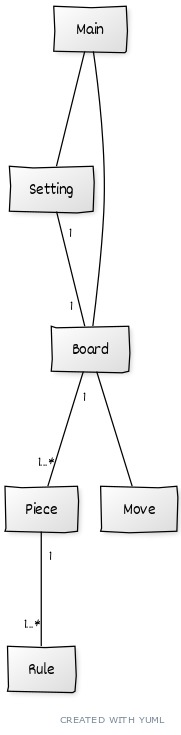

## Luokkakaavio
Sovellus ajetaan Main moduulin kautta, tämä tullaan rikkomaan myöhemmin pienemmiksi paloiksi.
Board edustaa pelilautaa ja samalla on pelimoottori. Tämäkin tullaan rikkomaan myöhemmin pienemmiksi
Setting on vastuussa pelin asetuksien säätämisestä. Tällä hetkellä Setting on hieman suuri, voisi rikkoa enemmän tulevaisuudessa
Piece edustaa yhtä nappulaa pelilaudalla, joka pystyy liikkumaan tietyllä tavalla, omistaa kuvan ja tietoa onko erikoisnappula kuten kuningas.
Rule on yksittäinen nappulan liikkumista koskeva sääntö.

Luokilla Piece ja Rule on monta aliluokkaa, Knight, King, Queen, SingleSlide, CombinedSlide, mutta näin pieneksi rikkominen ei ole oleellista koko sovellusta kattavassa luokkakaaviossa

